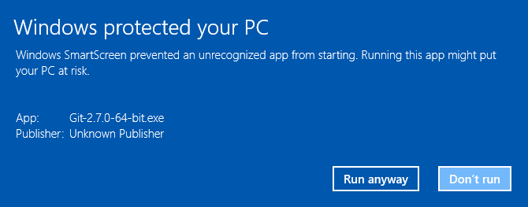
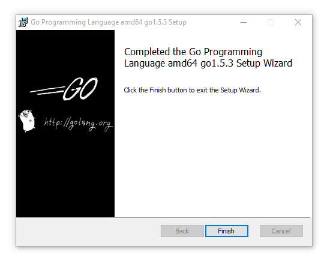

# Workshop Deutsche Börse Group

<!-- START doctoc generated TOC please keep comment here to allow auto update -->
<!-- DON'T EDIT THIS SECTION, INSTEAD RE-RUN doctoc TO UPDATE -->
**Table of Contents**

- [Prerequisites](#prerequisites)
- [Setting up your development environment](#setting-up-your-development-environment)
- [Git](#git)
  - [Installing Git on Windows](#installing-git-on-windows)
  - [Installing Git on OSX](#installing-git-on-osx)
- [Google's Go Language](#googles-go-language)
  - [Installing Go on Windows](#installing-go-on-windows)
  - [Installing Go on OSX](#installing-go-on-osx)
- [JetBrains IntelliJ IDEA](#jetbrains-intellij-idea)
- [Setting up your development environment (OSX)](#setting-up-your-development-environment-osx)

<!-- END doctoc generated TOC please keep comment here to allow auto update -->

## Prerequisites

Every developer needs a set of tools to work with. These may vary depending on the eco system, but the following steps are
quite common amongst today's cloud developers. Before we jump into action, there are a few tools that need
to be downloaded and installed to and on your PC:

1. Download [Git](https://git-scm.com/downloads). Git works on Windows, Linux and Mac OSX.
2. Download [Google's Go Language](https://golang.org/dl/). Go works on Windows, Linux, Mac OSX, Android and other platforms.
3. Download [JetBrains IntelliJ IDEA Community Edition](https://www.jetbrains.com/idea/download/download-thanks.html?code=IIC).
   If the link provided does not work, try [this one](https://www.jetbrains.com/idea/). IntelliJ works on Windows, Linux and Mac OSX
   and is one of the most common Integrated Developer Environments (IDE) today.

While these tools are downloading, [set up an account on GitHub](https://github.com/join). You can use any email address you wish. If
you do not want to provide your personal email, you can use a "trash mailer", for example [byom.de](https://www.byom.de/).

## Setting up your development environment

### Git

Git is a Versioning Control System (VCS) developed by Linux founder Linus Torvalds and others. Git was designed because
the Linux Kernel Development got out of hand and a better VCS was needed.

#### Installing Git on Windows

Unfortunately, Microsoft *might* block the installation of Git. This is due to missing certificates, as most open source
projects do not have the resources to buy such an certificate from Microsoft. If you see an error like this one

there is no need to worry. Git has been around for years and is used by hundreds of thousands of developers every day
and is completely open source and peer reviewed. To override the faulty Windows SmartScreen, click on **More info**

and press **Run anyway**. Now, the installer should start.

There is no need for customization while installing and you can simply use the default settings
by pressing **Next >**. When the installer is done, you should see this:

Congratulations, you have now installed the tool that every developer has on your machine.

#### Installing Git on OSX

### Google's Go Language

Go is an open source programming language that makes it easy to build simple, reliable, and efficient software. It is
developed by Google and was introduced because Google had significant problems maintaining their code base.

Over time, the large scale projects at Google got significantly more complex were increasingly hard to maintain and
scale in aspects of human and computational resources. Go is therefore primarily aimed at companies that process huge
amounts of data in a large, distributed and cloud native way.

Today, six years after release, Go is the backbone of almost every modern, scalable cloud application. Companies like Amazon,
Cloudflare, Spotify or IBM, just to name a few, are using Go in their production systems. Modern infrastructure systems
like Docker, Cloud Foundry or Kubernetes are written primarily in Go.

#### Installing Go on Windows

Installing Go on Windows is straight forward. You can leave all defaults as-is. Once Go is installed, you should
see a screen similar to this one:

#### Installing Go on OSX

### JetBrains IntelliJ IDEA

## Setting up your development environment (OSX)

Before we jum

To do: Check intellij, git etc. on a clean machine

Prerequisites
+ Go
+ Set up GOPATH
+ Git / github ui
+ IntelliJ IDEA & Go Plugin for IntelliJ
+ Set up GitHub account

Introductory tasks
+ Set up workspace (= gopath)
+ fork the project
+ clone the project using github ui
+ Use Postman to make some requests
  + get
  + post
+ Use go test to show how things are easier with tests

Tasks
+ Modify contacts to represent the group (leave the *how* open)
+ Push to fork and

Deploy to heroku or flynn

Have a running, beautiful react app accessing that backend

-> Separation of backend and frontend
-> Microservices
-> Test Driven Development
-> Set up deployment automation!